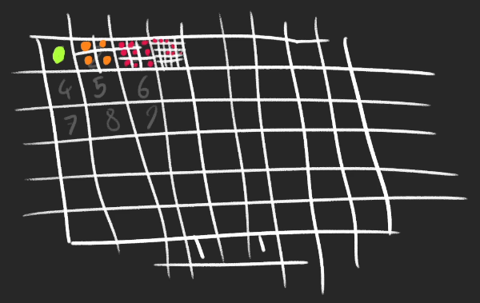

```javascript
            //Script 4
```
### Controls
Instanciating
* the **OrbitControls** class cannot be access with **THREE.OrbitControls**
* What to do?
  * the class is located in **/node_modules/three/examples/gsm/controls/OrbitControls.js**
  * we can import with **import { OrbitControls } from "three/examples/gsm/controls/OrbitControls.js"**
  * or
  * **import { OrbitControls } from "three/examples/jsm/controls/OrbitControls.js";**
* declare it after the camera declaration - good practice
* Instantiate **OrbitControls**
* The class needs camera and a DOM element for mouse events.
> it should response to mouse activity and touch for mobiles

### Target :
By default, the camera is looking at the center of the scene
We can change the **target** property which is a vector3
* controls.target.y = 1; //it won't work unless it get updated
* controls.update();

> issue : cube is moving as fast as mouse - so quick - it look not pleasing
### Damping 
The damping will smooth the animation by adding some king of acceleration and friction
* to enable damping, switch the **enableDamping** property to true

```
controls.enableDamping = true;
```
> issue : damping should work even after dragging dropping. in this case it stops right after leaving the mouse

The result might be strange because we need to update it on each frame 
Call **controls.update()** in the tick() function
```
    controls.update();
```

### When to use built in controls
controls are handy, but they have limitations, if you want to use those, make sure that 
they support all the features you need, if not you will have to do it on your own

## Full Screen and Resizing
our canvas current resolution is *800 X 600*, let's fix that and fill the whole available space

### Fit in the ViewPort
to get the viewport width and height, use **window.innerWidth** and **window.innerHeight**

> issue : it's working but there is a margin on the top and the left and we can scroll, this is because browser default stylings

* we are going to add CSS to the **src/style.css** file
* A good thing to do first would be to remove any type of **margin** or **padding** on all element by using a wildcard "*"; 
> margin removed now what about scroll bars?

* 1. Move the canvas on the top left corner
```css
.webgl{
    position : fixed;
    top : 0;
    left : 0;
    /* some might have a blue outline on the canvas when drag and dropping */
    outline : none;
}
```
> now scrollbars are erased
> issue : if you scrolldown beyond the limit, it will show the white page.
* to make sure that the page is impossible to scroll, add **overflow : hidden** on both html and body
```css
html,body{
    overflow : hidden;
}
```

### Handle Resize
> issue : it doesn't update it's viewport size automatically, according to resizing window

* we need to know when the window is being resized, listen to the **resize** event;
```javascript
window.addEventListener('resize', () =>{
    console.log('window has been risized');
})
```
* update the resize variable
```javascript
//viewport
const size = {
    width : window.innerWidth,
    height : window.innerHeight
}
window.addEventListener('resize', () =>{
    sizes.width = window.innerWidth;
    sizes.height = window.innerHeight;

    //update camera
    camera.aspect = sizes.width/sizes.height;
    camera.updateProjectMatrix();

    //update renderer
    renderer.setSize(sizes.width, sizes.height);
})
```
* still nothing happened......
* update the **camera** aspect ratio with the **aspect*** property
* when changing properties like **aspect**, we need to call **camera.updateProjectMatrix()**
* something is happening but still our canvas is not able to take available space
* update the **render** with **setSize(...)**
* NICELY DONE

The Render should be fine with resizing

## Handle Pixel Ratio
some might see a blurry render and stairs effect on the edges, If so, It's because you are testing on a screen with a pixel ratio greater than 1
> like not perfect cube -> like not perfect edges -> can see stairs on the edges

The pixel ratio corresponds to how many physical pixels you have on the screen for one pixel unit on the software part

### Some History
* Few years ago, all screens had a pixel ratio of 1 and if you looked closely, you could see those pixels
* Constructors like Apple saw an opportunity and started building screen with a pixel ratio of 2
* now, some constructors are making even higher pixel ratios like three and even more
* A pixel ratio of 2 means 4 times more pixel to render
* A pixel ratio of 3 means 9 times more pixel to render
* highest pixel ratios are usually on the weakest devices - mobiles
;
## Handle the Pixel ratio
* To get the current pixel ratio, we can use **window.devicePixelRatio** 
* To update the **renderer** accordingly, we can use **renderer.setPixelRatio(...)**
* pixel ratio of 2 is enough, my monitor pixel ratio is 1;
* more pixel then we have to render more

```javascript
//renderer
const canvas = document.querySelector(".webgl");
const renderer = new THREE.WebGLRenderer({
    canvas : canvas
})
renderer.setSize(size.width, size.height);
//Pixel ratio
renderer.setPixelRatio(window.devicePixelRatio);
```
> issue : still not much difference
* Avoid doing this because it might be too much to handle for the device Limit to something like 2
```javascript
//renderer
const canvas = document.querySelector(".webgl");
const renderer = new THREE.WebGLRenderer({
    canvas : canvas
})
renderer.setSize(size.width, size.height);
//Pixel ratio
// renderer.setPixelRatio(window.devicePixelRatio);
renderer.setPixelRatio(Math.min(window.devicePixelRatio,2));
```
* Max pixel we will render will be 2, because it's more then enough already, why need 2+ pixels? 
* Also do it to the **resize** event in case the other user changes the window from a screen to another

### Handle fullScreen - gaming experience
let's add support to a fullscreen mode by double clicking anywhere, listen to the **dblclick** event
* To know if we are already in fullscreen, we can use **document.fullscreenElement**
* To go to fullscreen mode use **requestFullscreen()** on the concerned element(our <canvas>);
* To leave the fullscreen mode use **exitFullscreen()** on the **document**
* Unfortunately, this won't work on Safari, we need to use predefined vesion. -> i actually don't care about safari