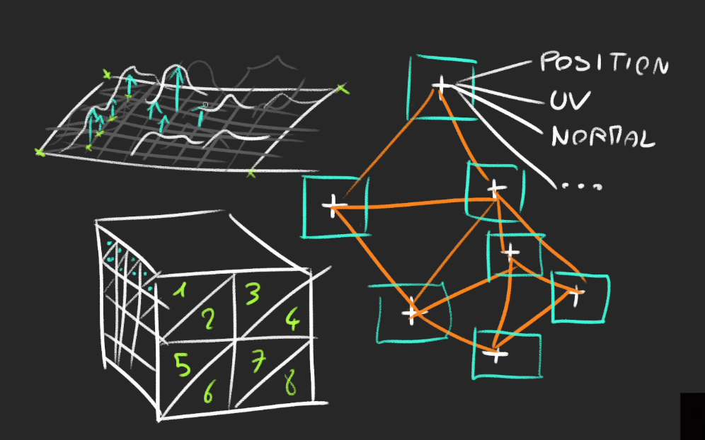
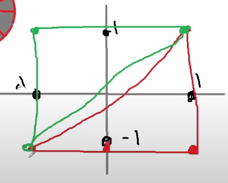

## Geometries
We only used the **BoxGeometry** but there are many other geometries
* What is a geometry?
  * Composed of **Vertices** (point coordinate in 3D space) and **Faces** (triangles that join those vertices to create a surface)
  * Can be used for meshes but also for particles
  * Can store more data than the positions (UV coordinates, normals, colors or anything we want)

### Built-in Geometries
All the following geometries inherit form **Geometry**. This class has many built in methods like **translate(...),rotateX(...),normalize()**,etc.

* **BoxGeometry**
* **PlaneGeometry**
* **CircleGeometry**
* **CloneGeometry**
* **CylinderGeometry**
* **RingGeometry**
* **TorusGeometry**
* **TorusKnotGeometry**
* **DodecahedronGeometry**
* **OctahedronGeometry**
* **TetrahedronGeometry**
* **IcosahedronGeometry**
* **SphereGeometry**
* **ShapeGeometry**
* **TubeGeometry**
* **ExtrudeGeometry**
* **LatheGeometry**
* **TextGeometry**

By combining those, we can create pretty complex shapes.
### **if it's too complex geometry, we are going to use 3D software**


### Box Example
* let's dive deeper into the **BoxGeometry**
  * **width** : The size of the **x** axis
  * **height** : The size of the **y** axis
  * **depth** : The size of the **z** axis
  * **widthSegments** : How many subdivisions in the **x** axis.
  * **heightSegments** : How many subdivisions in the **y** axis.
  * **depthSegments** : How many subdivisions in the **z** axis.
* Subdivisions correspond to how much triangles should compose a face.
  * **1** = 2 triangle per face
  * **2** = 8 triangles per face
* **issue :** The problem is that we cannot see triangels
* **Solution :** we can use **wireframe : true** on the **material**



```javascript
//subdivision (x,y,z,subx,suby,subz);
const geometry = new THREE.BoxGeometry(1,1,1,2,2,2);
//wireframe
const material = new THREE.MeshBasicMaterial({
    color : 'green',
    wireframe : true
});
```
### Create Your Own Geometries
### Buffer Geometries

* While wandering the Three.js documentation, you probably came across "BufferGeometry"
* Buffer geometries are more efficient and optimized but less developer friendly

### Creating your Own Buffer Geometry
* Before creating the geometry, we need to understand how to store buffer geometry data
  * We are going to use **Float32Array**
    * Typed Array
    * can only store floats
    * fixed length  
    * Easier to handle for the computer
  * There are two ways of creating and filling a Float32Array
    * specify a length and then fill the array  
```javascript
const geometry = new THREE.BufferGeometry();
const positionsArray = new Float32Array(9);

  //first vertices (x,y,z)
postionsArray[0] = 0;
postionsArray[1] = 0;
postionsArray[2] = 0;

//second vertices (x,y,z)
postionsArray[3] = 0;
postionsArray[4] = 1;
postionsArray[5] = 0;

//third vertices (x,y,z)
postionsArray[6] = 1;
postionsArray[7] = 0;
postionsArray[8] = 0;
```
* use an array
```javascript
const positionsArray = new Float32Array([
  0, 0, 0, //first vertices
  0, 1, 0, //second vertices
  1, 0, 0 //third vertices
])
```
* it's a one dimensional array where the first 3 values are the **X**, **Y** and **Z** coordinates of the first vertex

* we can convert that Float32Array to a BufferAttribute
```javascript
const positionsArray = new THREE.BufferAttribute(positionsArray,3);
// 3 corresponds to how much values compose one vertex
```
We can add this **BufferAttribute** to our **BufferGeometry** wit setAttribute(...)
```javascript
//geometry.setAttribute('name', bufferAttribute)
geometry.setAttribute('position', positionsAttribute)
```
**positions** is the name that will be used in the shaders

> we can aslo create bunch of random triangles

### INDEX
* Some geometry have faces that share common vertices
* when creating a **BufferGeometry** we can specify a bunch of vertices and then the indices to create the faces and re-use vertices multiple times