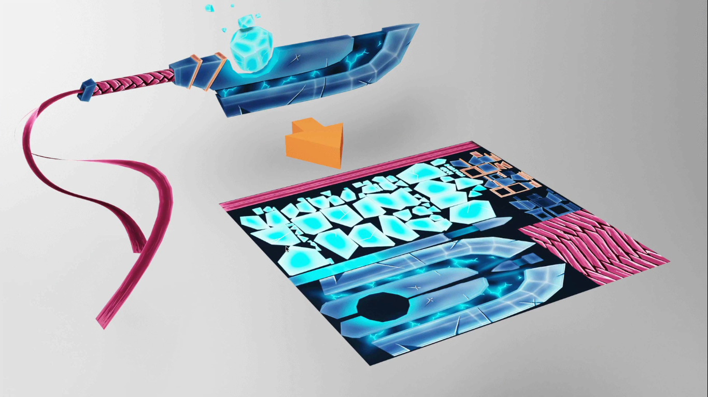

## DEBUG UI
* We need to be able to tweak and debug easily
* It concerns the developer, the designer and even the client
* It will help finding the perfect color, speed, quantity etc

### We can create our own or we can use a library
* **dat.GUI**
* **control-panel**
* **ControlKit**
* **Guify**
* **Oui**

> We are going to use **dat.GUI** but you should try the other ones

### How to Implement dat.GUI
* We need to add the **dat.GUI** dependency like we added the **gsap** dependency
```bash
npm install --save dat.gui
```
```javascript
//debug
import * as dat from 'dat.gui'
//instantiate
const gui = new dat.GUI();
```
* There are different types of elements you can add to that panel
  * **Range** : for numbers with minumum and maximum value
  * **Color** : for colors with various formats
  * **Text** : for simple text
  * **Checkbox** : for boolean **true** or **false**
  * **Select** : for choice from list of values
  * **Button** : to trigger functions
  * **Folder** : to organise your panel if you have too many elements

* Add Elements
  * Use gui.add(...) to an element (a tweak)
    *  the first parameter is an object
    *  the second parameter is the property you want to tweak
    * > gui.add(mesh.position, 'y');
    * Debug works on objects, object must be declared before debug
```javascript
//cube1 
const cube1 = new THREE.Mesh(
    new THREE.BoxGeometry(1,1,1),
    new THREE.MeshBasicMaterial({
        color : "violet",
        wireframe : true
    })
)
scene.add(cube1);
//debug mesh 
//y should be small or it won't work
gui.add(cube1.position, "y"); // y axis
```
* the next parameter handles
  * min
  * max
  * step (precision)
```javascript
gui.add(cube1.position, 'y', -3, 3, 0.01);
//or
gui.add(cube1.position, 'y').min(-1).max(2).step(0.01);
//or also change name with label method
gui.add(cube1.position, 'y')
.min(-1)
.max(2)
.step(0.01)
.name('elevation');
```
* dat.GUI will change the type of tweak according to the type of the property
* Add a tweak for the **visible** property
```javascript
//control visibility 
gui.add(mesh, 'visible');
gui.add(material, 'wireframe')
```
* Colors
  * we need to **addColor()** because dat.gui cannot guess that it's not a simple string
  * we have to create a temporary object in order to have an accessible property
  * Create a **parameter** variable at the start of your code
```javascript
const parameters = {
  color : 0xff0000
}
gui
   .addColor(parameters,'color')
//now we have to update the material when the tweak change
   .onChange(() =>
   {
    material.color.set(parameters.color);
   })
```
* Changing the color doesn't affect the material
* we need to apply the **parimeter.color** on the material when the color changed
* Instead of specifying **0xff0000** in the **parimeter** and in the material, we can use the **parimeter.color** on the material

### Functions
* to trigger a function, we need to store it in an object, we can use the **parameters** object again and create a **spin** method

### TIPS - gui
* hide
  * press **H** to hide the panel
  * If you want the panel to be hidden at start, use gui.hide()
* close
  * close the panel by clicking on its bottom part
  * if you want your panel to be closed at start, send an object when instantiating and pass it **closed : true**
```
const gui = new dat.GUI({closed : true})
```
* width
  * You can drag and drop the panel to change it's width
  * You can change the default width with width : ...
```
const gui = new dat.GUI({width : 400});
```
> End if script 1
---

### TEXTURES
* What are Textures?
  * Textures are images that will cover the surface of the geometries
  * Many types and many different effects
* we are going to discover the most used types with the **door textures** by joao paulo
* **Color or Albedo**
  * most simple one
  * applied on the geometry
* **Alpha**
  * Grayscale image
  * White visible
  * Black not visible
* **Height or Displacement**
  * Greyscale image
  * Move the vertices to create some relief
  * Need enough subdivision
* **Normal**
  * Add details
  * Doesn't need subdivision
  * The vertices won't move
  * Lure the light about the face orientation
  * Better performances than adding a height textures with a lot of subdivision
* **Ambient occlusion**
  * Greyscale image
  * Add fake shadows in crevice
  * Not physically accurate
  * Helps to create contrast and see details
* **Metalness**
  * Greyscale image
  * White is metallic
  * Black is non metallic
  * Mostly for reflection
* **Roughness**
  * Greyscale image
  * In duo with the metalness
  * White is rough
  * Black is smooth
  * Mostly for light dissipation

* **PBR** - metalness & Roughness
  * Physically based rendering
  * Many technics that tend to follow real-life directions to get realistic results
  * Becoming the standard for realistic renders
  * Many softwares, engines, and libraries are using it

> How to load textures
* Getting the url of the image
```javascript
import imageSource from '../src/apple.png'
//or
const imageSource = '../src/apple.png'
```

* load the image?
```javascript
const image = new Image()
image.onload = () =>
{
  console.log("image loaded");
}
image.src = '../src/apple.png'
```
> We cannot use that image directly and we need transform it into a **Texture** 
* create texture variable with **Texture** class
```javascript
const image = new Image()
image.addEventListener('load',() =>
{
  const textures = new THREE.Texture(image);
  //not better approach
})
image.src = '../src/apple.png'
```
* we need to use that **texture** in the **material**
* Unfortunately, the **texture** variable has been declared in a function and we cannot access it outside a function

> another approach
* We can create texture outside of the function and update it once the image is loaded with **needsUpdate = true**
```javascript
const image = new Image();
const texture = new THREE.Texture(image);
image.addEventListener('load', () =>
{
  texture.needsUpdate = true;
})
image.src = '../src/apple.png'
```
* replace the **color** property by **map** and use the **texture**
```javascript
const material = new THREE.MeshBasicMaterial({map : texture})
```
### Using texture loader
* Instantiate a variable using the TextureLoader and use its **.load()** method to create a texture
```javascript
const textureLoader = new THREE.TextureLoader()
const texture = textureLoader.load('../src/lion.jpg')
```
> one texture loader can load multiple textures
```javascript
const textureLoader = new THREE.TextureLoader()
const texture = textureLoader.load('../src/lion.jpg');
const texture = textureLoader.load('../src/lion.jpg');
const texture = textureLoader.load('../src/lion.jpg');
const texture = textureLoader.load('../src/lion.jpg');
```
* we can send 3 functions after the path
  * **load** : when the image loaded successfully
  * **progress** : when the loading is progressing
  * **error** : if something went wrong
```javascript
const textureLoader = new THREE.TextureLoader()
const texture = textureLoader.load(
  '../src/lion.jpg',
  () =>
  {
    console.log("load");
  },
  () =>
  {
    //not much useful or not much info on it
    console.log('progress');
  },
  () =>
  {
    console.log('error');
  });
```

### Using the loading manager
* we can use **LoadingManager** to mutualize the events
* it's useful if we want to know the global loading progress or be informed when everything is loaded
* Create and instance of the **LoadingManager** class and pass it to the **TextureLoader**
```javascript
//we use this when working with big projects  
const loadingManager = new THREE.LoadingManager();
const textureLoader = new THREE.TextureLoader(loadingManager);
//how to know when loading is done?
```
* Listen to the events by replacing the following properties by your own functions
```javascript
const loadingManager = new THREE.LoadingManager();
loadingManager.onStart = () =>
{
  console.log("Loading started");
}
loadingManager.onLoaded = () =>
{
  console.log('loading finished');
}
loadingManager.onProgress = () =>
{
  console.log('loading progressing');
}
loadingManager.onError = () =>
{
  console.log('loading error');
}
const textureLoader = new THREE.TextureLoader(loadingManager);
```

### UV unwrapping
* Replace the BoxGeometry by other geometries
```javascript
const geometry = new THREE.BoxBufferGeometry(1,1,1);
//or
const geometry = new THREE.SphereBufferGeometry(1,32,32);
//or
const geometry = new THREE.ConeBufferGeometry(1,1,32);
//or
const geometry = new THREE.TorusBufferGeometry(1,0.35,32,100);
```
> issue : textures are stretching and contracting at some point
* The texture is being stretched or squeezed in different ways to cover the geometry
* This is called **UV unwrapping** and it's like unwrapping and origami or a candy wrap to make it flat
* Each vertex will have a 2D coordinate on a flat plane (usually a square)


* we can see those uv coordinates in **geometry.attributes.uv**
```
console.log(geometry.attributes.uv);
```
* Those UV coordinates are generated by Three.js
* if you created your own geometry you'll have to specify the UV coordinated.
* if you are making the geometry using a 3D software, you will have to do the UV unwrapping

### transforming the textures
* **Repeat**
  * We can repeat the texture by using the **repeat** property
  * it's a **Vector2** with x and y properties
```javascript
const colorTexture = textureLoader.load('../src/lion.jpg');
colorTexture.repeat.x = 2;
colorTexture.repeat.y = 3;
```
* By default, the texture doesn't repeat and the last pixel get stretched
* we can change that with **THREE.RepeatWrapping** on the **wrapS** and **wrapT** properties
```javascript
//single face = 2*3 images
colorTexture.repeat.x = 2;
colorTexture.repeat.y = 3;
colorTexture.wrapS = THREE.RepeatWrapping
colorTexture.wrapT = THREE.RepeatWrapping
or
colorTexture.wrapS = THREE.MirrorRepeatWrapping
colorTexture.wrapT = THREE.MirrorRepeatWrapping
```
### Offset
* we can offset the texture using the **offset** property which is **Vector2**
```javascript
//try with mirrorRepeatWrapping
colorTexture.wrapS = THREE.MirrorRepeatWrapping
colorTexture.wrapT = THREE.MirrorRepeatWrapping
colorTexture.offset.x = 0.5;
colorTexture.offset.y = 0.5;
```
### Rotation
* we can rotate the texture using the **rotation** property
```
colorTexture.rotation = Math.PI * 0.25;
```
* Remove the **offset** and **repeat** properties to notice that the rotation occurs around the bottom left corner
* That is **0,0** UV coordinates
> Math.PI = half rotation

* Controlling pivot point of rotation
* We can change the pivot point with the **center** property which is a **Vector2**
```javascript
colorTexture.rotation = Math.PI * 0.25;
colorTexture.center.x = 0.5;
colorTexture.center.y = 0.5;
```


### Filtering and MipMapping
* If you look at the cube's top while the face is almost hidden, you will see a blurry texture
* that is due to filtering and mipmapping

* **Mipmapping** is a technique that consist of creating half a smaller version of a texture agian and again unitl we get a **1X1** texture
* All those texture variations are sent to the GPU, and the GPU will choose the most appropriate version of the texture


> Issue : when zoom out the cube the texture on cube is squeezed or glitcy texture.
* All of this is already handeled by three.js and the GPU but we can choose different algorithm.
* There are two types of filter algorithms
  * **Minification filter**
    * happens when the pixels of the texture are smaller then the pixels of the render
    * In other words, the texture is too big for the surface, it covers
    * we can change the minification filter of the texture using the **minFilter** property with those 6 values
      * **THREE.NearestFilter**
      * **THREE.LinearFilter**
      * **THREE.NearestMipmapNearestFilter**
      * **THREE.NearestMipmapLinearFilter**
      * **THREE.LinearMipmapNearestFilter**
      * **THREE.LinearMipmapLinearFilter** (default)
```javascript
const patternTexture = textureLoader.load('../src/pattern1.png');
patternTexture.minFilter = THREE.NearestFilter;
```
* **Magnification Filter**
  * Happens when the pixels of the texture are bigger than the pixels of the render
  * In other words, the texture is too small for the surface it covers
  * it looks bad, but it depends on the context
  * if the effect isn't too exaggerated, the user will probably not notice
  * we can change the magnification filter of the texture using the **magFilter** property with those 2 values
    * **THREE.NearestFilter**
    * **THREE.LinearFilter** (default)
```javascript
const patternTexture = textureLoader.load('../src/pattern2.png');
patternTexture.magFilter = THREE.NearestFilter;
```
> **THREE.NearestFilter** is cheaper than the other ones, if the result is fine with you, just use it. BETTER PERFORMANCE
* if we are using **THREE.NearestFilter** on **minFilter**, we don't need the minmaps
* we can deactivate the minmaps generation with **patternTexture.generateMinmaps = false**

### Texture Format and Optimisation
* when preparing your textures, keep in mind three crucial elements
* the weight
* the size (or the resolution)
* the data

**weight**
* the user will have to download the textures, choose the right type of file
  * **.jpg** : lossy compression but usually lighter
  * **.png** : lossless compression byt usually heavier
  * you can use compression websites and softwares like **TinyPNG**
**size**
* Each pixels of the textures will have to be stored on the GPU regardless of the images weight
* GPU has storage limitations
* It's even worse because mipmapping increases the number of pixels to store
* Try to reduce the size of the image as much as possible
* the mipmapping will produce a half smaller version of the texture repeatedly until **1X1**
* Because of that, the texture width and height must be a power of 2
  * **512 X 512**
  * **1024 X 1024**
  * **512 X 2048**
**data**
* textures supports transparency but we can't have transparency in **.jpg**
* if we want to have only one texture that combine color and alpha, we better use **.png** file
* if we are using a **normal** texture we want to have the exact values which is why we shouldn't apply lossy compression and we better use **.png** for those 
* sometimes we can combine different data into one texture by using the red, green, blue and alpha channels seperatly


> the difficulty is to find the right combination of texture formats and resolution 

* Where to find textures?
  * it's always hard to find perfect textures
  * a good start would be to search on the web
    * **poliigon**
    * **3Dtextures.me**
    * **arroway-textures.ch**
* Always make sure that you have the right to use the texutres if it's not for personal usage.
* you can also create your own textures with photos and 2D softwares like photoshop or even procedural textures with 
**Substance Designer**