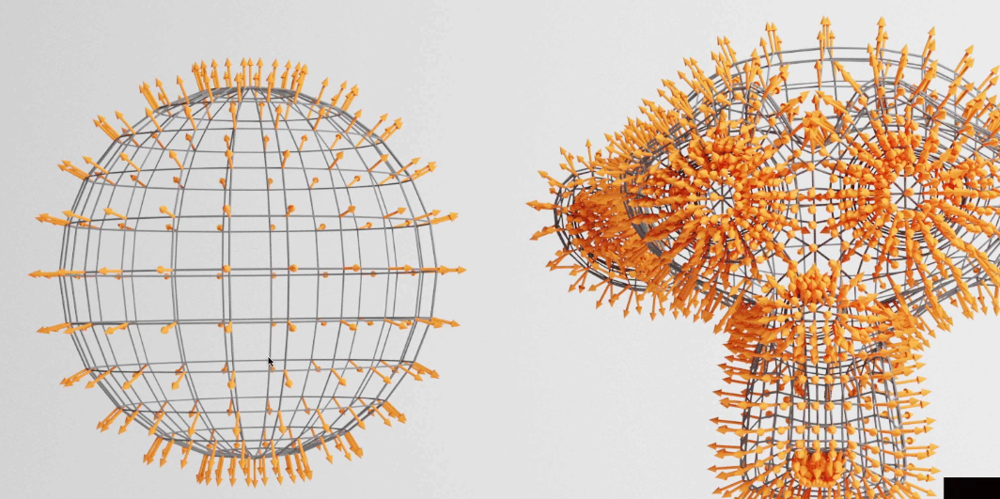

> script2material :
## Materials
* materials are used to put a color on each visible pixels of the geometries
* The algorithms are written in programs calles shaders
* We don't need to write shaders and we can use built in materials

Create 3 meshes composed of 3 geometries ( a sphere, a plane and a torus)
use MeshBasicMaterial on all three

* Until now we used the **MeshBasicMaterial** which applies a uniform color or a texture on our geometry.
  
### THREE js Materials
* **Mesh Basic Material**
Most of material properties can be set in two ways
```javascript
const material = new THREE.MeshBasicMaterial({
    map : doorColorTexture
})
//or also we can combine map and color
const material = new THREE.MeshBasicMaterial();
material.map = doorColorTexture;
material.color = new THREE.Color('green');
material.wireframe = true
//alpha : opacity + transparent
material.transparent = true;
material.opacity = 0.5;

//alphamap : controls transparency with texture
//blackportion hidden else shown
material.transparent = true;
material.alphamap = doorAlphaTexture;

//side lets you decide which side of the face is visible
//THREE.FrontSide (default), BackSide, DoubleSide (try to avoid GPU)
material.side = THREE.DoubleSide
```

* **Mesh Normal Material**

* Normals are information that contain the direction of the outside face
* Normals can be used for lighting, reflection, refraction etc.
* properties : **wireframe, transparent, opacity, side and flatShading**
* **flatshading** will flatten the faces, meaning the normals won't be interpolated between the vertices
* used to debug normals
```javascript
//displays nice purple color
const material = new THREE.MeshNormalMaterial();
//directions for GPU?
console.log(sphere.geometry.attribute);
material.flatshading = true;
```
* **Mesh Matcap Material**
* it will display a color by using the normals as a reference to pick the right color on a texture that looks like a sphere

```javascript
//we will get an illusion that the object are being illuminated
const material = new THREE.MeshMatcapMaterial();
material.matcap = matcapTexture;
```

* **Mesh Depth Material**
* it will simply color the geometry in white, if it's close to the **near** else in black if it's close to the **far** value of camera

* **Adding few lights**
```javascript
//Ambient light
const ambientLight = new THREE.AmbientLight(0xffffff, 0.5);
scene.add(ambientLight);

//point light
const pointLight = new THREE.PointLight(0xffffff, 0.5);
pointLight.position.x = 2;
pointLight.position.y = 3;
pointLight.position.z = 4;
scene.add(pointLight);
```
* **Mesh Lambart Material**
* it react to light
* good performance
* can see strange pattern

* **Mesh Phong Material**
* it react to light
* strange pattern gone
* we can control light reflection with **shininess** and the color of this reflection with **specular**
```javascript
material.shininess = 100;
material.specular = new THREE.color(0x1188ff);
```
* **Mesh Toon Material**
* like a **MeshLambertMaterial** with cartoonish;
* to add more steps to coloration you can use **gradientMap** property and use the **gradientTexture**
```javascript
material.gradientMap = gradientTexture;
```
* issue : we see a gradient of a clear seperation because the gradient is small and the **magFilter** tries to fix it with the **mipmapping**
* resolve : Set the **minFilter** and **magFilter** to **THREE.NearsetFilter**
* we can also deactivate the mipmapping with
```javascript
gradientTexture.minFilter = THREE.NearestFilter;
gradientTexture.magFilter = THREE.NearestFilter;
gradientTexture.generateMipmaps = false;
```
* **Mesh Standard Material**
* it uses physically based rendering principles (PBR);
* like **MeshLambertMaterial** and **MeshPhongMaterial**, it supports lights but with more realistic algorithm and better parameters like **roughness** and **metalness**.

### Add a debug UI
* Add GUI of particular geometry right after creating that geometry.
```bash
npm install --save dat.gui
```
```javascript
import * as dat from 'dat.gui'
const gui = new dat.GUI();
```
* **aoMap** (ambient occlusion map) will add shadows where the texture is dark, we must add a second set of UV named **uv2**
* In our case, it's the same coordinates as the default UV so we are going to reuse it 
> UV coordinates : materials.geometry -> attributes -> uv -> array[]
```javascript
const material = new THREE.MeshStandardMaterial();
material.map = doorColorTexture;
material.aoMap = doorAmbientOcclusion;
material.aoMapIntensity = 1;
// 2 for no of values in single vertex
sphere.geometry.setAttribute('uv2', new THREE.BufferAttribute(sphere.geometry.attributes.uv.array,2)); 
```
* **displacementMap** will move the vertices to create a relief
```javascript
material.displacementMap = doorHeightTexture;
//how to control no of subdivisions
//height, width, subdivisionHeight, subdivisionwidth
const plane = new THREE.PlaneGeometry(1,1,100,100);
//same goes for all the geometries
//increase the subdivisions and wireframe on
material.displacementScale = 0.05;
```
* it should look terrible because it lacks vertices and displacement is way too strong

* Instead of specifying uniform **metalness** and **roughness** for the whole geometry, we can use **metalnessMap** and **roughnessMap**
* still looks weird because the **metalness** and **roughness** properties still affect each map respectively
* comment **metalness** and **roughness** and use their original value;
* **normalMap** : will fake the normals orientation and add details on the surface regardless of the subdivision
* we can change the normal intensity with the **normalScale** property (**Vector2**)
* finally we can control the alpha using **alphaMap** property
* don't forget the **transparent = true**

**Mesh Physical Material**
* same as **MeshStandardMaterial** but with support of clear coat effect.
* Its more calculations for the GPU

**Points Material** : can use with particles
**Shader Material and Raw Shader Material** : used to create your own materials

---
> Script 3 Environment maps
> 
**Environment Map**
* The environment map is an image of what's surrounding the scene
* it can be used for reflection or refrection but also for general lighting
* Environment maps are supported by multiple materials but we are going to use **MeshStandardMaterial**

```javascript
const material = new THREE.MeshStandardMaterial();
material.metalness = 0.7;
material.roughness = 0.2;

gui.add(material, 'metalness').min(0).max(1).step(0.0001);
gui.add(material, 'roughness').min(0).max(1).step(0.0001);
```
* three js only supports cube environment maps
* to load cube texture, we must use the **CubeTextureLoader** instead of the **TextureLoader**

```javascript
const cubeTextureLoader = new THREE.CubeTextureLoader()
//now we will provide 6 direction [cube] image, east, west, north, south, sky and ground
//Array of six path
//loading environment texture [p = +ve in graph and n = -ve in graph]
const environmentMapTexture = cubeTextureLoader.load(
    [
        '../static/textures/environmentMaps/0/px.jpg',
        '../static/textures/environmentMaps/0/nx.jpg',
        '../static/textures/environmentMaps/0/py.jpg',
        '../static/textures/environmentMaps/0/ny.jpg',
        '../static/textures/environmentMaps/0/pz.jpg',
        '../static/textures/environmentMaps/0/nz.jpg'
    ]
);
```
* use the **environmentMapTexture** in the **envMap** property of the material
### where to find environment maps
* **HDRI heaven** : not a cube map, **CC0 licence** - you can do anything you want with them without having to credit the authors, if you appreciate their work, thank them by subscribing their **Patreon**

> issue : how to convert HDRI's to cube maps
> resolved : use this online tool -> github -> HDRI to cubeMap
> https://matheowis.github.io/HDRI-to-CubeMap/

