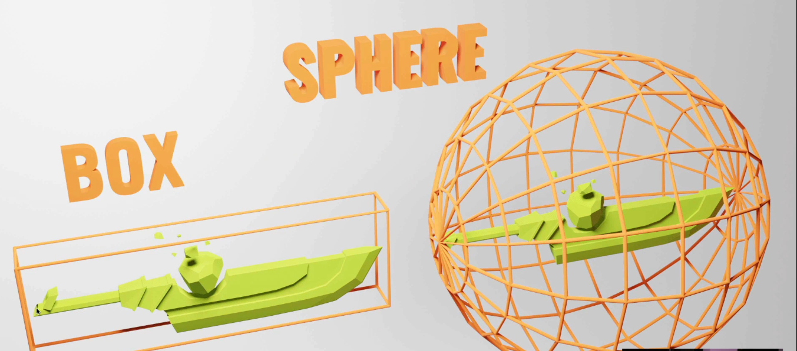
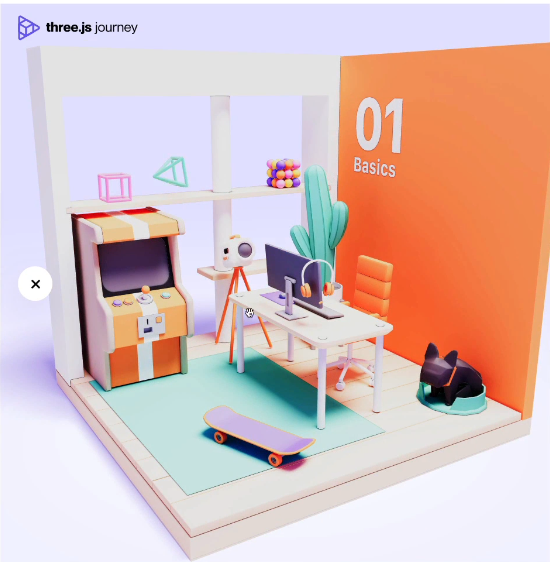
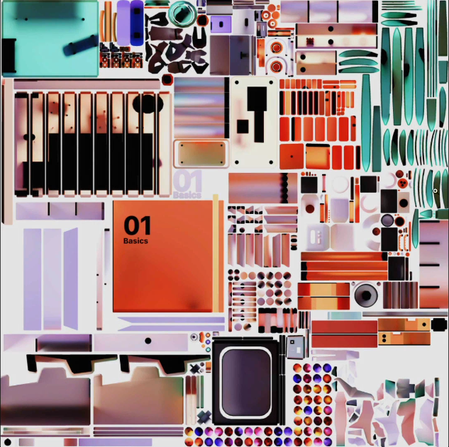
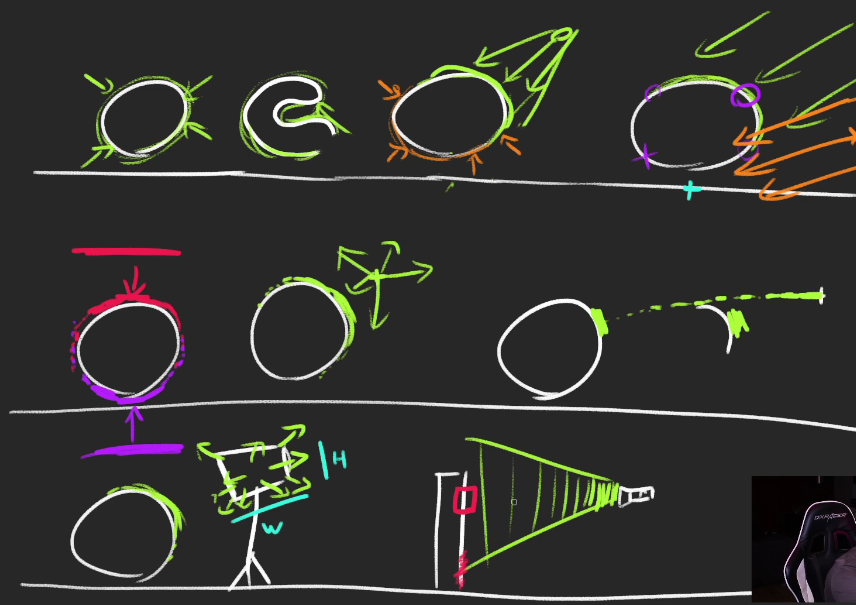

## 3D Text
### Introduction
* we are going to do what **ilithya** did with her cool portfolio
* https://www.ilithya.rocks/
* create a **big 3D Text** in the middle of the scene with **Objects floating around**

* we are going to use the **TextGeometry** class but we need a particular font format called **typeface**
* if you are using a typeface you have downloaded, you must have the right to use it.

**How to get a typeface font**
* we can convert a font with tools like
* we can also use fonts provided by three.js 
* go to **/node_modules/three/examples/fonts/** folder
* We can take the fonts and put them in the **static** folder or we can import them directly

```javascript
import typefaceFont from 'three/examples/fonts/helvetiker_regular.typeface.json';
```

we will mix those two techniques
* open **/node_modules/three/examples/fonts/**
* take **helvetiker_regular.typeface.json** and **LICENSE** files
* put them in the **/static/fonts** folder

### Font Loader
```javascript
//FontLoader is an add-on, and must be imported explicitly.
import { FontLoader } from 'three/examples/jsm/loaders/FontLoader.js';
const fontLoader = new FontLoader();
```
* unlike the **TextureLoader**, we have to write the rest of our code inside the success function
* create the geometry **TextGeometry**
```javascript
//TextGeometry is an add-on, and must be imported explicitly.
//checkout object of font
import { TextGeometry } from 'three/examples/jsm/geometries/TextGeometry.js';
const fontLoader = new FontLoader();
fontLoader.load(
    '../static/fonts/helvetiker_regular.typeface.json',
    (font) =>
    {
        console.log(font);
        const textGeometry = new TextGeometry(
            'Hello 3D world',
            {
                font : font,
                size : 0.5,
                height : 0.2,
                curveSegments : 12,
                bevelEnabled : true,
                bevelThickness : 0.03,
                bevelSize : 0.02,
                bevelOffset : 0,
                bevelSegments : 5
            }
        );
        const textMaterial = new THREE.MeshBasicMaterial();
        const text = new THREE.Mesh(textGeometry, textMaterial);
        text.position.x = -2;
        scene.add(text); 
    }
)
```
* You can test the geometry by adding **wireframe : true** to your material
> const textMaterial = new THREE.MeshBasicMaterial({wireframe : true});
* creating a text geometry is long and hard for the computer
* Avoid doing it too many times and keep the geometry as low poly as possibel by reducing the **curveSegment** and **bevelSegment**.

* **Center the Text**
* use **axesHelper** to understand the positioning
* **Using the Bounding**
  * the bounding is the information associated with the geometry that tells what space is taken by that geometry
  * it can be a box or a sphere

* it helps three.js calculate if the object is on the screen (**frustum culling**) 
* We are going to use the bounding measures to recenter the geometry.
* **Frustum Culling** performance -> render only those on the screen
* By default, Three.js us using sphere bounding
* Calculate the box bounding with **computeBoundingBox()**
```javascript
textGeometry.computeBoundingBox();
console.log(textGeometry.boundingBox)
//try to understand the location of boundingBox
//our goal is to aline center the text
//rotate geometry not the mesh
```
**translate** property can move all the vertices
* so instead of moving the mesh, we are going to move the whole geometry with **translate()**
```javascript
//centered geometry but not perfectly check min and max values of the text geometry is not still same
textGeometry.translate(
    - textGeometry.boundingBox.max.x * 0.5,
    - textGeometry.boundingBox.max.y * 0.5,
    - textGeometry.boundingBox.max.z * 0.5
)
```
* the text looks centered but it's not because of the **bevelThickness** and the **bevelSize**
```javascript
textGeometry.translate(
    //bevel size and bevel thickness
    - (textGeometry.boundingBox.max.x - 0.02) * 0.5,
    - (textGeometry.boundingBox.max.y - 0.02) * 0.5,
    - (textGeometry.boundingBox.max.z - 0.03) * 0.5
)
```
* this was long but there is much faster way
* call the **center()** method on the geometry
```
textGeometry.center();
```

### Add a matcap material
### Add objects
* always in success function, create 100 donuts
### optimise
```javascript
console.time('donuts');
//some loop
console.timeEnd('donuts);
```
* our code needs optimization
* we can use the same material and the same geometry on multiple meshes
```javascript
const donutGeometry = new THREE.TorusGeometry(0.3,0.2, 20, 45);
const donutMaterial = new THREE.MeshMatcapMaterial({matcap : matcapTexture});
for(let i = 0; i < 100; i++){
    //code
}
```
* we can go further by using the same material as for the **text**
* remove the **donutMaterial**, rename the **textMaterial** by **material** and use it for both the **text** and the **donut**

---
## Lights
* **Ambient Light**
  * The **AmbientLight** applies **Omnidirectional lighting**
  * properties : **color** , **intensity**
  * We can use it to simulate light bouncing
```javascript
const ambientLight = new THREE.AmbientLight('white',0.5);
//or
const ambientLight = new THREE.AmbientLight();
ambientLight.color = new THREE.Color(0xffffff);
ambientLight.intensity = 0.5;
scene.add(ambientLight);

gui.add(ambientLight, 'intensity').min(0).max(1).step(0.001);
```
* **Directional Light**
  * it will have a **sun** like effect as if the sun rays were travelling in parallel
  * properties : **color**, **intensity**
  * to change the direction, move the light
  * the distance of the light doesn't matter for now
```
directionalLight.position.set(1,0.25,0);
```
* **Hemisphere Light**
  * similar to **ambientLight** but with different color from the sky than the color coming from the ground
  * propertied **color (or skyColor)**, **groundColor** and **intensity**
```javascript
const
``` 
* **Point Light**
  * it is like a **lighter**, the light starts at an infinity small point and spreads uniformly in every direction
  * properties **color**, **intensity**
  * by default the light intensity doesn't fade, we can control the fade distance and how far it fades with the **distance** and **decay**
```javascript
//Distance and decay property of point light, decay should be lower than distance
const pointLight = new THREE.PointLight(0xff9000, 0.5, 10,2);
pointLight.position.set(2,2,0)
scene.add(pointLight);
```
* **Rect Area Light**
  * it works like the big rectangle lights you can see on the photoshoot set
  * it's mix between a directional light and a diffuse light
  * property **color**, **intensity**, **width**, **height**
  * it only works with **standard** and **physical** material
  * you can then move the light and rotate it   
  * you can also use **lookAt(...)** to rotate more easily
```javascript
rectAreaLight.position.set(-1.5, 0, 1.5);
//vector3 is position 0,0,0
rectAreaLight.lookAt(new THREE.Vector3());
```
* **Spot Light**
  * it's like a flash light
  * it's a **cone** of light **starting at a point** and **oriented in a direction**
  * properties **color**, **intensity**, **distance**, **angle**, **penumbra**, **decay**
  * to rotate the **SpotLight**, we need to add its **target** property to the scene and move it
```javascript
//color, intensity, distance, angle, penumbra(sharpness), decay
const spotLight = new THREE.SpotLight(0x78ff00,0.5,10,Math.PI * 0.1, 0.25, 1)
spotLight.position.set(0,2,3);
scene.add(spotLight);

//rotate spotlight, the target is not in our scene so the position is not working, we have to add the target/~~~~
spotLight.target.position.x = -0.75;
//adding target into the scene
scene.add(spotLight.target)
```

### Performances
* lights can cost a lot when it comes to performances, try to add as few lights as possible and try to use the light that cost less
* Minimal cost -> **ambient Light** , **hemisphere Light**
* moderate cost -> **Directional Light** , **point Light**
* high cost -> **spot Light** , **rect Area Light**

### Baking
* The idea is to bake the light into the texture, this can be done in 3D software
* The drawback is that we cannot move the light anymore and we have to load huge textures




### Helpers
* we cannot see the source of light or position of source light
* To assist us with positioning the lights, we can use helpers
  * **HemisphereLightHelper**
  * **DirectionalLightHelper**
  * **PointLightHelper**
  * **RectAreaLightHelper**
  * **SpotLightHelper**
```javascript
//light Helpers
//parameters - concerned light, size of helper
const hemisphereLightHelper = new THREE.HemisphereLightHelper(hemisphereLight, 0.2);
scene.add(hemisphereLightHelper);

const directionalLightHelper = new THREE.DirectionalLightHelper(directionalLight, 0.2);
scene.add(directionalLightHelper);

const pointLightHelper = new THREE.PointLightHelper(pointLight,0.2);
scene.add(pointLightHelper);
```

* the spotlight has no size, we also need to call its **update()** method on the next frame after moving the target

```javascript
const spotLightHelper = new THREE.SpotLightHelper(spotLight);
scene.add(spotLightHelper);
window.requestAnimationFrame(() =>
{
    spotLightHelper.update();
})
```
* **RectAreaLightHelper** isn't part of three, it's an addon, so we have to import it
* we need to update it on the next frame and also update its **position** and **rotation** manually
```javascript
const rectAreaLightHelper = new RectAreaLightHelper(rectAreaLight);
scene.add(rectAreaLightHelper);
//don't know why but it's not working
window.requestAnimationFrame(() =>
{
    rectAreaLightHelper.position.copy(rectAreaLight.position);
    rectAreaLightHelper.quaternion.copy(rectAreaLight.quaternion);
    rectAreaLightHelper.update();
})
```
