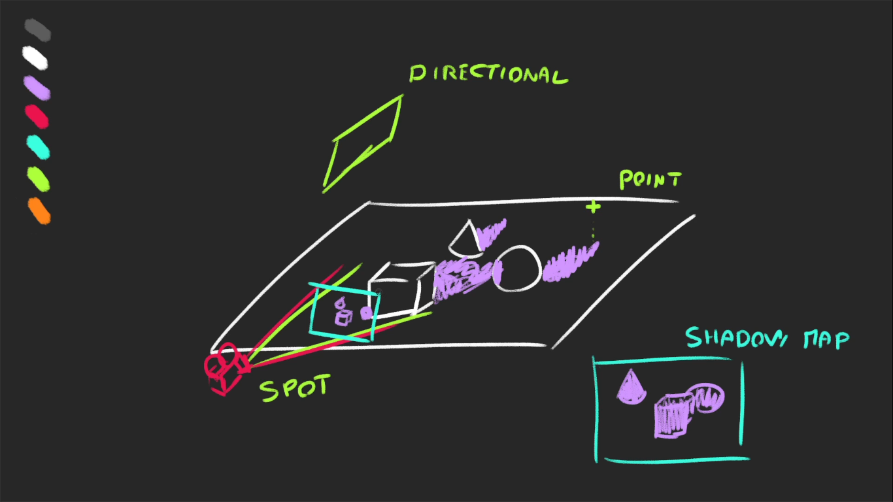

# Shadows
* Now that we have lights, we want shadows
* the dark shadow in the back of the object are called **core shadows**
* What we are missing are the **drop shadows**
* Shadows have always been a challenge for real time 3D rendering, and developers must find tricks to display realistic shadows at a reasonable frame rate

### How it works
* when you do one render, Three.js will do a render for each light supporting shadows
* those renders will simulate what the light sees as if it was a camera.
* During these lights renders, a **MeshDeapthMaterial** replaces all meshes material
* The lights renders are stored as textures and we call those **shadow maps**
* They are used on every materials supposed to receive shadows and projected on the geometry



### How to activate shadows
* Activate the shadow maps on the **renderer**
```
renderer.shadowMap.enabled = true;
```
* Go through each **object** and decide if it can cast a shadow with **castShadow** and if it can receive a shadow with **receiveShadow**
```
sphere.castShadow = true;
plane.receiveShadow = true;
```
* only the following types of light support shadows
  * **Point Light**
  * **Directional Light**
  * **Spot Light**

* Activate the shadows on the light with the **castShadow**
```
directionalLight.castShadow = true;
```
### Shadow map optimization
* **Render Size**
  * We can access the shadow map in the **shadow** property of each light
```
console.log(directionalLight.shadow)
```
* by default, the shadow map size is **512 X 512**
* we can improve it but keep a power of 2 for the mipmapping
```javascript
//shadowmap optimization
console.log(directionalLight.shadow);
//shadowmap optimization - resolution
directionalLight.shadow.mapSize.width = 1024;
directionalLight.shadow.mapSize.height = 1024;
```
### Near and Far
* Three.js is using cameras to do the shadow maps renders
* Those cameras have the same properties like a **near** and **far**
* to help us debug, we can use a **CameraHelper** with the camera used for the shadow map located in the **directionalLight.shadow.camera**
* this **near** and **far** property we are talking about right now is of shodow camera length not the camera length
```javascript
//lightHelper - help debug
const directionalLightCameraHelper = new THREE.CameraHelper(directionalLight.shadow.camera);
scene.add(directionalLightCameraHelper);
```
* We can now find decent **near** and **far**
```javascript
//shadowmap will be created for this much area
directionalLight.shadow.camera.near = 1;
directionalLight.shadow.camera.far = 6;
```
* **Amplitude**
  * with the camera helper we can see that the amplitude is too large, because we are using **Directional Light**, three.js is using an **OrthographicCamera**
  * We can control how far on each side the camera can see with **top**, **right**, **bottom** and **left**
```javascript
//shadow map - amplitude(length of each side)
directionalLight.shadow.camera.top = 2;
directionalLight.shadow.camera.right = 5;
directionalLight.shadow.camera.bottom = -2;
directionalLight.shadow.camera.left = -5;
//notice the shadow sharpness is much better now
```
* The smaller the values, the more precise the shadow will be, if it's too small, the shadow will be cropped
* we can hide the camera helper
```
directionalLight.cameraHelper.visible = false;
```
* **Blur**
  * You can control the shadow blur with the **radius** property;
  * this techniue doesn't use proximity of the camera with the object, it's a general and cheaper blur
```
directionLight.shadow.radius = 10;
```
* **shadowmap algorithm**
* different types of algorithms can be applied to shadow maps
  * **THREE.BasicShadowMap** - very performant but lousy quality
  * **THREE.PCFShadowMap** - less performant but smoother edges (default)
  * **THREE.PCFSoftShadowMap** - less performant but even softer edges
  * **THREE.VSMShadowMap** - less performant, more constraints, can have unexpected results
* update the **renderer.shadowMap.type**
```
//radius doesn't work with the PCFSoftShadowMap;
renderer.shadowMap.type = THREE.PCFSoftShadowMap;
```
* **Spotlight**
```javascript
const spotLight = new THREE.SpotLight(0xffffff, 0.4, 10, Math.PI * 0.3);
spotLight.castShadow = true;
spotLight.position.set(0,2,2);
scene.add(spotLight);
scene.add(spotLight.target);
```
* Add a camera helper
* mixing shadows doesn't look good and there is not much to do about it
* we can improve the shadow quality using the same technique that we used for the direction light
* Because we are using a **SpotLight**, three.js is using a **PerspectiveCamera** We must change the **fov** property to adapt the amplitude
```javascript
spotLight.shadow.camera.fov = 30;
//near and far values
spotLight.shadow.camera.near = 1;
spotLight.shadow.camera.far = 6;
```
* **Point Light**
```javascript
//pointlight
const pointLight = new THREE.PointLight(0xffffff, 0.4);
pointLight.castShadow = true;
pointLight.position.set(-1,1,0);
scene.add(pointLight);
```

* Add a camera helper
```javascript
const pointLightCameraHelper = new THREE.CameraHelper(pointLight.shadow.camera);
scene.add(pointLightCameraHelper);
```
* the camera helper seems to be **PerspectiveCamera** facing downward, Three.js uses a **PerspectiveCamera** but in all 6 directions and finishes downwards
* 6 directions means 6 canvas render
* we can tweak the **mapSize**, **near** and **far**
```javascript
pointLight.shadow.mapSize.width = 1024;
pointLight.shadow.mapSize.height = 1024;
pointLight.shadow.camera.near = 0.1;
pointLight.shadow.camera.far = 5;
```
* hide the camera helper
> pointLight.cameraHelper.visible = false;

* **Baking Shadows**
* A good alternative to three.js shadows is baked shadows
* we integrate shadows in textures that we apply on material

* Deactivate all shadows from the renderer
> renderer.shadowMap.enabled = false;

```javascript
//Load the shadow
const textureLoader = new THREE.TextureLoader();
const bakedShadow = textureLoader.load('bakedTexture pic location')
```

* Instead of **MeshStandardMaterial** use a **MeshBasicMaterial** on the plane material with the **bakedShadow**
```javascript
//shadow won't be dynamic
const plane = new THREE.Mesh(
  new THREE.PlaneGeometry(8,8),
  new THREE.MeshBasicMaterial({map : bakedShadow})
)
//now the shadow is printed on plane and if you move the object, the same shadow will be there
```
* **Baking Shadows Alternative**
* we can also use more simpler baked shadow and move it so it stays under the sphere
> the idea is we are going to **diffuse shadow** and we will move it along the object and if object goes higher we will reduce the alpha value of the shadow

* Put back **Mesh Standard Material** on the plane
```javascript
const plane = new THREE.Mesh(
  new THREE.PlaneGeometry(10,10),
  material
)
```
* load the basic shadow texture
> issue : we have to put the texture right above the plane but if we put the same x values, three.js will get confused -> which one should be visible and it will cause glitch
> solution : we are going to create a plane right above the plane

* Create a plane slightly above the floor with an **alphaMap** using the **simpleShadow**
```javascript
const sphereShadow = new THREE.Mesh(
  new THREE.PlaneGeometry(1.5,1.5),
  new THREE.MeshBasicMaterial({
    color : 0x000000,
    transparent : true,
    alphaMap : simpleShadow
  })
)
sphereShadow.rotation.x = - Math.PI * 0.5;
sphereShadow.position.y = planePosition.y + 0.01
scene.add(sphereShadow);
```
* Animate the sphere in the **tick** function
```javascript
const tick = () =>
{
    const elapsedTime = clock.getElapsedTime();

    //orbit controls
    controls.update();

    //object
    sphere.rotation.x = elapsedTime * 0.25;
    sphere.rotation.y = elapsedTime * 0.25;

    //update the sphere
    sphere.position.x = Math.cos(elapsedTime) * 3;
    sphere.position.z = Math.sin(elapsedTime) * 3;
    sphere.position.y = Math.abs(Math.sin(elapsedTime * 3));

    //update the shadow
    sphereShadow.position.x = sphere.position.x;
    sphereShadow.position.z = sphere.position.z;
    sphereShadow.material.opacity = (1 - sphere.position.y) * 0.5;
    // sphereShadow.material.opacity = (1 - Math.abs(sphere.position.y)) * 0.5;

    //renderer
    renderer.render(scene,camera);

    //animation
    window.requestAnimationFrame(tick);
}
tick()
```
* you can go further by scaling the shadow
### which technique to use
* Finding the right solution to handle shadows is up to you, It depends on the project, the performance and technique you know, you can also combine them