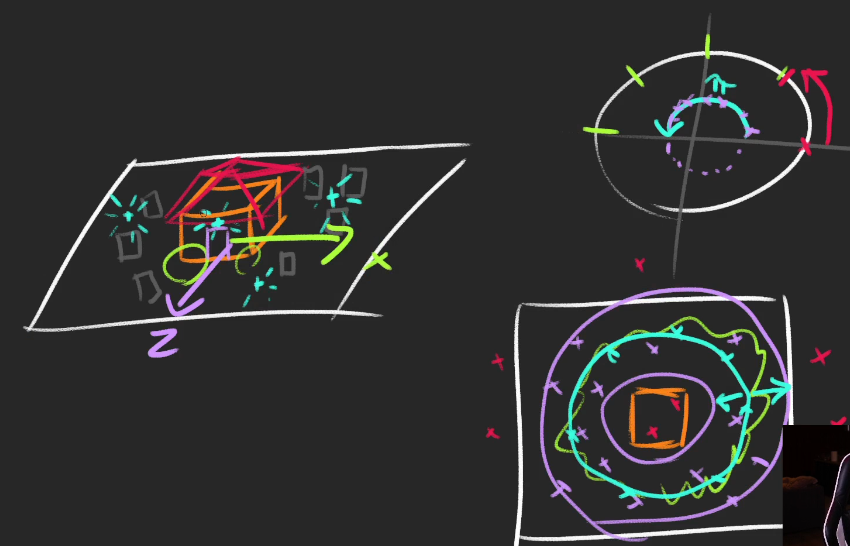

# Haunted house
### tips for measurements
* instead of using random measures we are going to consider 1 unit as 1 meter
## The House
* Remove the sphere but leave the floor
* Create a house group
* 1. Create the walls
```javascript
const walls = new THREE.Mesh(
    new THREE.BoxGeometry(4,2.5,4),
    new THREE.MeshStandardMaterial({color : '#ac8e82'})
)
walls.position.y = 1.25;
house.add(walls);
```
* create a roof with a pyramid, **ConeGeometry**
```javascript
const roof = new THREE.Mesh(
    new THREE.ConeGeometry(3.5,1,4),
    new THREE.MeshStandardMaterial({color : '#b35f45'})
)
roof.rotation.y = Math.PI * 0.25;
roof.position.y = 1.25 + 0.5;
house.add(roof);
```
* Add bushes and use the same geometry and same material for every bushes
 
 * **The Graves**
 * Instead of placing each grave manually, we are going to create and place them procedurally
 * create a graves container
 * create one **BoxGeometry** and one **MeshStandardMaterial** that we will use for the graves meshes
```javascript
const graves = new THREE.Group();
scene.add(graves);
const graveGeometry = new THREE.BoxBufferGeometry(0.6,0.8,0.2);
const graveMaterial = new THREE.MeshStandardMaterial(color : "brown");
```

* create graves all around the house
```javascript
for(let i = 0; i < 50; i++){
    const angle = Math.random() * Math.PI * 2;
    const radius = 3 + Math.random() * 6;
    const x = Math.cos(angle) * radius;
    const z = Math.sin(angle) * radius;

    //create the mesh
    const grave  = new THREE.Mesh(graveGeometry, graveMaterial);
    graves.add(grave);

    //position
    grave.position.set(x, 0.3, z);
}
```
;

* **Lights**
* Dim the ambient and moon light a give those a more bluish color
* Add a warm **pointLight** above the door and add it to the house instead of the scene
```javascript
const doorLight = new THREE.PointLight('#ff7d46',1,7);
doorLight.position.set(0,2.2,2.7);
house.add(doorLight); 
```
* **Fog**
* we can see the edges of the ground
* three.js supports fog with the **Fog** class
  * **color**
  * **near** - how far from the camera does the fog starts
  * **far** - how far from the camera will the fog be fully opaque
* to fix the background, we must change the clear color or the **renderer** and use the same color as fog.
* we can do it with the **setClearColor(..)** on the renderer
```
const fog = new THREE.Fog('#262837', 1, 15);
//activate fog
scene.fog = fog;
renderer.setClearColor('#262837');
```
* **Textures**
  * the door - load all and apply them to the door
  * the walls - load all and apply them to the wall
  * the floor - load all grass and apply them
  * play with **repeat** of grasses texture
    * Change the **wrapS** and **wrapT** properties to ativate the repeat
* **Ghosts**
* idea : we are not going to create a real ghost, instead we are going to repeat them with simple lights floating around the house and passing through the ground and graves.
* animate them
*  **Shadows**
   *  