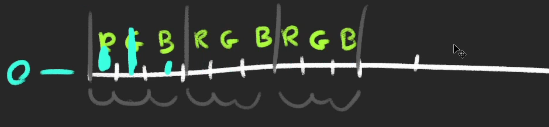
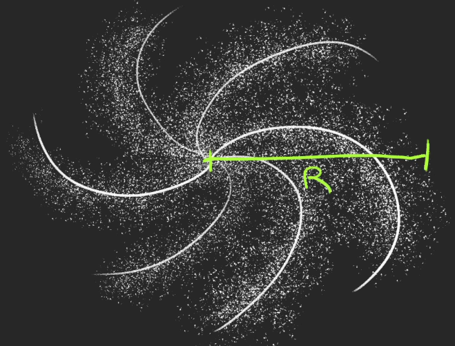

* Particles can be used to create **stars, smoke, rain, dust, fire,**etc. You can have thousands of them with a reasonable fram rate
* Each particle is composed of a plane (two triangles) always facing the camera
* Creating particles is like creating a **Mesh**
  * A **geometry** (**BufferGeometry**)
  * A **material** (**PointsMaterial**)
  * A **Points** instance (Instead of a Mesh)
  
## First particles
* instantiate a **SphereBufferGeometry**
* Each vertex of the geometry will become the particle
```javascript
const particlesGeometry = new THREE.SphereGeometry(1,32,32);    
```
* **PointsMaterial**
  * Instantiate a **PointsMaterial**
  * change the **size** property to control all the particles size and the **sizeAttenuation** to specify if distant particles should be smaller than close particles
```javascript
//object
const particlesGeometry = new THREE.SphereGeometry(1,32,32);
const particlesMaterial = new THREE.PointsMaterial({
    size : 0.02,
    sizeAttenuation : true
})
//Points
const particles = new THREE.Points(particlesGeometry, particlesMaterial);
```
* **custom geometry**
* instead of **SphereGeometry**, create **BufferGeometry** and add a **position** attributes as we did in the geometries lesson
```javascript
const particlesGeometry = new THREE.BufferGeometry();
const count = 500;
const position = new Float32Array(count * 3);
for(let i = 0; i < count * 3; i++){
    positions[i] = (Math.random() - 0.5) * 10;
}
particlesGeometry.setAttribute('position', new THREE.BufferAttribute(positions,3));
```
* **Color, Map and AlphaMap**
* we can change the color of all the particles with the **color** property on the **PointsMaterial**
> particlesMaterial.color = new THREE.Color('#ff88cc')
* we can also use the **map** property to put a texture on those particles.
```javascript
const textureLoader = new THREE.TextureLoader()
const particlesTexture = textureLoader.load('texture image location');
particlesMaterial.map = particleTexture;
```
> issue : if you look closely, you will see the font particles are hiding the back particles
* solution : activate the transparency and use the texture on the **alphaMap** property instead of the **map**

```javascript
particlesMaterial.transparent = true;
particlesMaterial.alphaMap = particleTexture;
```
* now it's better but not perfect, we can still see the edges of the particles
* That is because the particles are **drawn in the same order as they are created**, and WebGL doesn't really know which one is the front of the other. 
* There are multiple ways of fixing this
  * Using alpha test
    * the **alphaTest** is the value between 0 and 1 that enables the webGL to know when not to render the pixel according to the pixel transparency
    * by default the value is 0 meaning that the pixel will be rendered anyway 
    * Use 0.001
    * particlesMaterial.alphaTest = 0.001
    * issue : now edge is gone but the litte image edge is not perfect
  * Using Depth Test
    * When drawing, the WebGL Tests if what's being drawn is closer than what's already drawn
    * that is called depth testing and can be deactivated with **depthTest**
    * first comment alphaTest
    * particlesMaterial.depthTest = false;
    * now it looks perfect, but deactivating the depth test might create bugs if you have another object in your scene or particles with different colors
    * Add a cube in the scene to see that
  * Using depth write
    * The depth of what is being drawn is stored in what we call a depth buffer
    * instead of not testing if the particles is closer than what's in this depth buffer, we can tell the WebGL not to write particles in the depth buffer with **dephtTest**
    * particlesMaterial.depthWrite = false
* we saw multiple techniques, and there is no perfect solution. You will have to adapt and find the best combination according to the project
* **Blending**
  * The WebGL currently draws pixels one on top of other. With the blending property, we can tell the webgl to add the color of the pixel to the color of the pixel already drawn
  * Change the blending propery to **THREE.ActiveBlending**
  * This effect will impact the performances
  * particlesMaterial.blending = THREE.ActiveBlending;
* **Different Colors**
  * we can have different color for each particles
  * add a **color** attribute with three values (red, green and blue)
```javascript
const positions = new Float32Array(count * 3);
const colors = new Float32Array(count * 3);
for(let i = 0; i < count * 3; i++){
    positions[i] = (Math.random() -0.5) * 10;
    colors[i] = Math.random();
}
particlesGeometry.setAttribute('position', new THREE.BufferAttribute(positions,3))
particlesGeometry.setAttribute('color', new THREE.BufferAttribute(colors,3))
const particles = new THREE.Points(particlesGeometry,particlesMaterial);
scene.add(particles);
```


* still the same result? no color change?
  * change the **vertexColors** property to **true**
  * particlesMaterial.vertexColors = true;
  * make sure to comment the color property
* **Animate**
  * There are multiple ways of animating particles
  * **By using the point as an object**
    * **Points** class inherits from the **Object3D** so we can move, rotate and scale the points
    * Rotate the particles in the tick function
    * particles.rotate.y = elapsedTime * 0.2
  * **By changing the attribute**
  * Goal : animating each particle
    * comment the rotation
    * we can update each vertex seperately in **particlesGeometry.attributes.position.array** because this array contains the particles position, we have to go 3 by 3
    * we are going to make the particles move up and down like waves and  to create waves, we can use sin
```javascript
//write this inside tick function
for(let i = 0; i < count; i++){
      const i3 = i * 3;
      particlesGeometry.attributes.position.array[i3 + 1] = Math.sin(elapsedTime);
}
```
* now out box looks like a plane aslo nothing seems moving
* nothing is moving because Three.js needs to be notified when a geometry attributes changes
* set the **needsUpdate** to **true** on the **position** attribute inside tick function
* particlesGeometry.attributes.position.needsUpdate = true;
* apply an offset to **sinus** so that we get that wave shape we can use the x coordinates
```javascript
//animation - clock
const clock = new THREE.Clock();
const tick = () =>
{
    const elapsedTime = clock.getElapsedTime();

    //particles
    // particles.rotation.y = elapsedTime * 0.2;
    particlesGeometry.attributes.position.needsUpdate = true;
    for(let i = 0; i < count; i++){
        const i3 = i * 3;
        const x =  particlesGeometry.attributes.position.array[i3]; 
        particlesGeometry.attributes.position.array[i3 + 1] = Math.sin(elapsedTime + x);
    }

    //update controls
    controls.update();

    //renderer
    renderer.render(scene,camera);

    //animation loop
    window.requestAnimationFrame(tick);
}
tick();
```
* you should avoid this technique because updating the whole attribute on each frame is bad for performances
* right now we are updating 1000s of particles, which is wrong
* **By using a custom shader**
  * the best way to animate particles is to create our own shader and will do that in later lesson
---
## Galaxy Generator
* we are going to create a galaxy generator and let the user tweak that galaxy with the debug panel 
* **Base Particles**
  * create a **generateGalaxy** function
  * create a **parameter** object that will contain all the parameters of our galaxy
  * create random particles based on that count parameter
  * create the **PointsMaterial** class and add a size parameter
  * crate the **Points**
* **Tweaks**
  * create the tweaks for the count and the size
  * issue : still nothing happended?
  * to know when to generate a new galaxy, you must listen to the change event
  * Use the **finishChange()** method and provide the generate galaxy function
```javascript
gui.add(parameters, 'count').min(100).max(1000000).step(100).onFinishChange(generateGalaxy);
gui.add(parameters, 'size').min(0.001).max(0.1).step(0.001).onFinishChange(generateGalaxy);
```
* issue : we are not removing the old galaxies, it just keep adding 
  * move the **geometry**, **material** and **points** variables outside the **generateGalaxy**
```javascript
//Galaxy
const parameters = {};
parameters.count = 1000;
parameters.size = 0.02;

let geometry = null;
let material = null;
let points = null;

const generateGalaxy = () =>
{
    //geometry
    geometry = new THREE.BufferGeometry();
    const positions = new Float32Array(parameters.count * 3);
    
    for(let i = 0; i < parameters.count; i++){
        const i3 = i * 3;
        
        positions[i3 + 0] = (Math.random() - 0.5) * 3;
        positions[i3 + 1] = (Math.random() - 0.5) * 3;
        positions[i3 + 2] = (Math.random() - 0.5) * 3;
    }
    geometry.setAttribute('position',new THREE.BufferAttribute(positions,3));
    
    //Material
    material = new THREE.PointsMaterial(
        {
            size : parameters.size,
            sizeAttenuation : true,
            depthWrite : false,
            blending : THREE.AdditiveBlending
        }
        )
        
        //Points
        points = new THREE.Points(geometry, material);
        scene.add(points);
    }
    generateGalaxy();
    
    gui.add(parameters, 'count').min(100).max(10000).step(100).onFinishChange(generateGalaxy);
    gui.add(parameters, 'size').min(0.001).max(0.1).step(0.001).onFinishChange(generateGalaxy);
```
* Before assigning those variables, we can test if they already exist and use the **dispose()** method to destroy the geometry and the material properly
* then remove the points from the scene with **remove()**
* instead of using a texture we are going to keep the default square shape
* **Shape**

  * we will create a spiral galaxy
  * **Radius**
    * create a radius parameter
    * position the vertices in a single straight line from the center and going as far as the radius
    * now you can see a straight line made from no of particles
  * **Branches**
    * create a branches parameter
    * position the particles on those branches

```javascript
//you can see three dots on the scene
//multiply both sin and cos by radius to see the lines
const radius = Math.random() * parameters.radius;
const branchAngle = (i % parameters.branches) / parameters.branches * Math.PI * 2;
        
positions[i3 + 0] = Math.cos(branchAngle);
positions[i3 + 1] = 0;
positions[i3 + 2] = Math.sin(branchAngle);
```
* **Spin**
  * create a spin parameter;
  * multiply the spin angle by the spin parameter
* **Randomness**
  * create a **randomness** parameter