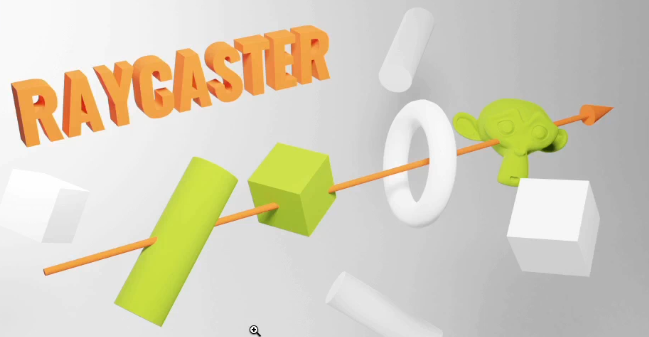

# Ray Caster
### introduction
* A raycaster can cast a ray in a specific direction and test what objects interacts with it
;

### usage
* detects if there is a wall in front of the player
* Test if the laser gun hit something
* test if something is currently under the mouse to simulate mouse events
* show an alert message if the spaceship is heading towards a planet

### create the ray caster
* we can use the **set(...)** method to set the **origin** and the **direction** **Vector3**
* The direction has to be normalized

### cast a ray
* two options
  * **intersectObject()** - to test one object
  * **intersectObject()** - to test array of objects

### result of an intersection
* always an array (even if you are testing only one object), because a ray can go through the same object multiple times [thing about donut]
* each items contains useful information
  * **distance** - distance between the origin of the ray and the collision point
  * **face** - what face of the geometry was hit by the ray
  * **faceIndex** - the index of that face
  * **object** - what object is concerned by the collision
  * **point** - a vector3 of the exact position of the collision
  * **uv** - the uv coordinates in that geometry

### test on each frame
* if we want to test things while they are moving, we have to do the test on each frame
* we are going to animate the spheres and turn them blue when they intersect with them
* now lets update the raycaster in the tick function
* update the material of the object property for each item of the **intersects** array
* issue : they all go blue but never red because all the objects intersects at start
* turn all the objects red before turning the onces that intersect blue

### use the raycaster with the mouse
* we can use the raycaster to test if an object is behind the mouse 
* Three.js will do all the heavy lifting

### hovering
* we need the coordinates of the mouse but not in pixels
* we need a value that goes from -1 to +1 in horizontal and verticla axis
* create a mouse variable with **Vector2** and update it when the mouse is moving
* use the **setFromCamera()** method to orient the ray in the right direction, the rest is the same

### mouse enter and mouse leave events
* mouse evnets like **mouseenter** and **mouseleave** etc. aren't supported
* create a witness variable containing the currently hovered object
* if an object intersects, but there wasn't one before, a **mouseenter** happened
* if no objects intersects, but there was one before, a mouse leave happened

### mouse click event
* we can test what object is being clicked

> using the raycaster can be hard but once you understand how to shoot a ray properly and how to handle the result, you can do a lot